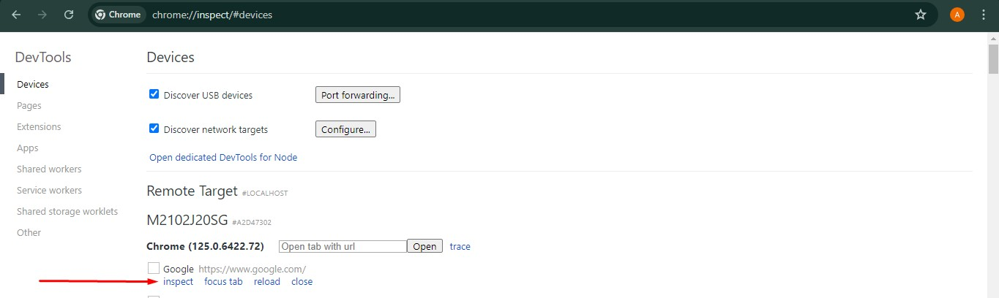
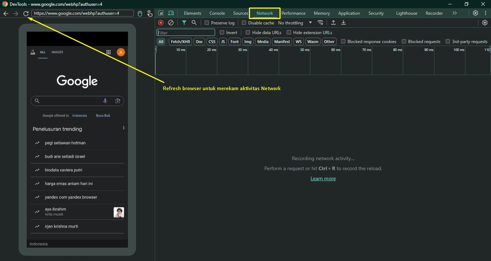
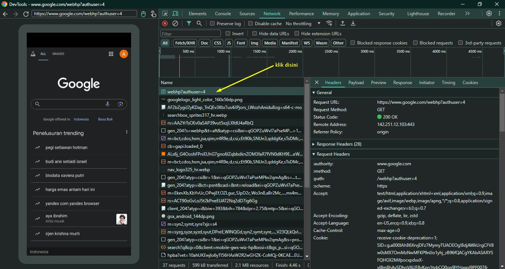
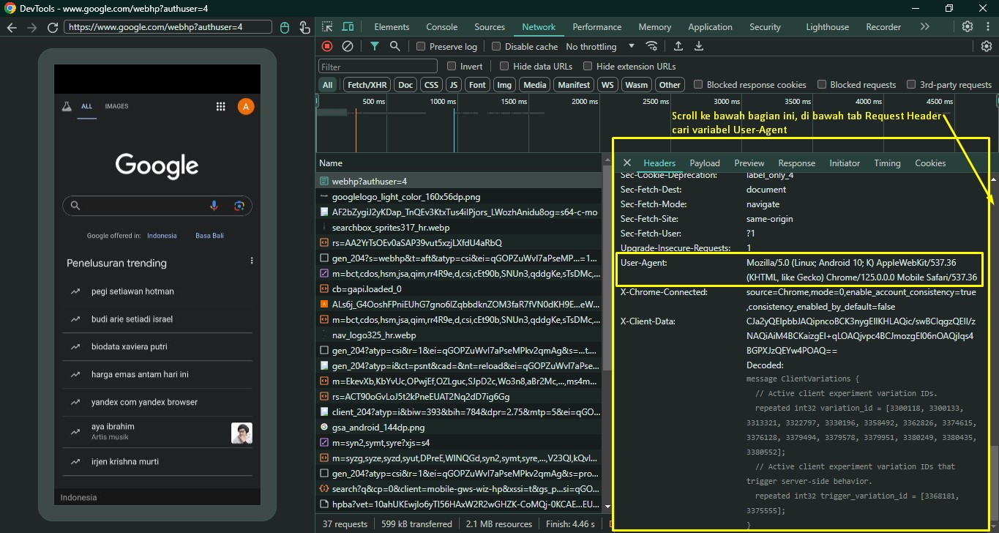

# TTC - Tap-Tap Cuan
TTC (Tap-TapCuan) multi auto claimbot untuk mempermudah cari cuan dari airdrop game Telegram Mini Apps

## Daftar Game
Daftar game yang sudah tersedia bot auto claim :
| Game | Link | Petunjuk |
| ------ |------ | ------ |
| Pocketfi | [Pocketfi Bot](https://t.me/pocketfi_bot/Mining?startapp=785466139) | [Tutorial Pocketfi Bot](pocketfi/README.md) |


## Petunjuk Umum
### Software yang dibutuhkan
- Install Python versi 3.10+
- Install library yang dibutuhkan
  ```sh
  pip install --upgrade -r requirements.txt
  ```
- Git
  > (Opsional) Jika menggunakan repositori ini menggunakan git. Mempermudah jika ada update tidak perlu download berulang kali.

### Mendapatkan _User-Agent_ & _query_id_
#### Android Smartphone
- Aktifkan mode developer tools pada Android Smartphone
- Aktifkan juga USB Debug tools
- Hubungkan Android Smartphone ke PC (Windows) kemudian buka browser Chrome
- Buka situs [Google](https://google.com) pada **Android Smartphone** menggunakan browser Chrome
- **Buka browser Chrome pada PC**, akses `chrome://inspect/#devices` untuk memeriksa apakah inspect devices sudah berhasil dijalankan. Jika berhasil akan muncul tampilan seperti gambar berikut:
  
- Klik inspect, akan muncul jendela baru _inspect element_. Pindah ke-Tab _Network_. Reload halaman pada browser Smartphone atau gunakan tombol _reload_ pada _inspect element_ untuk mendapatkan rekaman aktivitas jaringan
  
- Klik salah satu aktivitas network paling atas
  
- Pada Tab _Header_ di samping kanan, scroll ke bawah pada bagian _Request Headers_, cari variabel _User-Agent_. Copy nilai _User-Agent_ yang biasanya diawali seperti `Mozilla/5.0 (Linux; Android 10; K) AppleWebKit/537.36 (KHTML, like Gecko) Chrome/125.0.0.0 Mobile Safari/537.36`
  
- Untuk mendapatkan _query_id_ baca masing-masing [petunjuk Bot](#daftar-game) karena query_id bersifat _unique_

#### IOS Iphone
- (Belum tersedia petunjuk penggunaan)


## Petunjuk Penggunaan
Jalankan file _python script_ (.py) pada masing-masing folder game project.
> Jika berada pada folder utama :
```sh
taptapcuan> python /folder_game/<nama_game>.py
```
> Jika masuk ke folder game terlebih dahulu :
```sh
taptapcuan> cd folder_game
taptapcuan\folder_game> python <nama_game>.py
```

:moneybag: **Happy Cuan!** :money_with_wings:

## Disclaimer
> Catatan:
>
> Kode bebas untuk dimodifikasi
>
> Jika terjadi error yang disebabkan oleh bug silahkan mengajukan pull-request
>
> **Segala sesuatu yang menyebabkan aktivitas dibanned oleh penyedia layanan bukan menjadi tanggung jawab kami**

## Catatan
> Untuk update terbaru dari repositori ini, bisa melakukan pull-repositori
  ```sh
  git pull
  ```

## Contact
| [Telegram](https://t.me/AyasMbois) | [Email](mailto:rundhik@yahoo.co.id) |

## License
GNU General Public License v3.0
