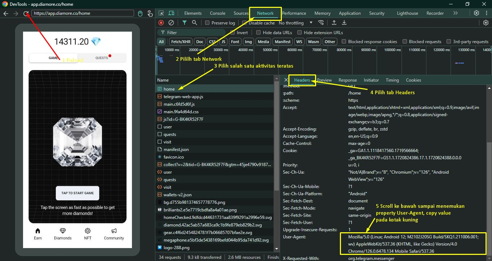
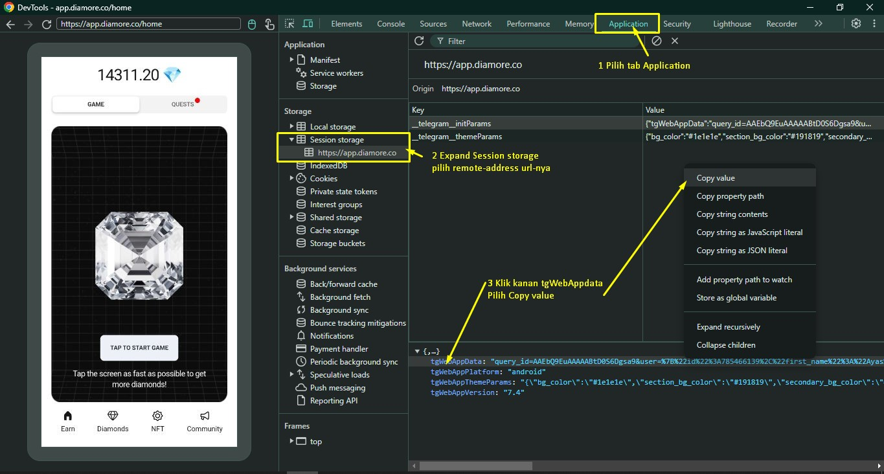

# Diamore
We created Diamore ecosystem to bring transparency and trustability to the diamonds industry - [Official Website](https://diamore.co/) .

## Fitur Bot
- Autoclaim daily reward
- Autoclaim 10 seconds fast tap-tap dengan nilai maksimal
- Autoclaim referal bonuses
- Multiple Account

## Mainkan Game
|  Link  Game |
| ----------- |
| [Diamore Bot](https://t.me/DiamoreCryptoBot/app?startapp=785466139) |
| [Diamore Bot](https://t.me/DiamoreCryptoBot/app?startapp=206741460) |

## Petunjuk Khusus
### Mendapatkan _User-Agent_ & _query_id_
- Pastikan sudah mengikuti [petunjuk umum](../README.md) untuk inspect Telegram Mini Apps
- Jika inspect device sudah berhasil lakukan _reload_ untuk mendapat rekaman aktivitas _Network_
- Masuk ke tab _Network_ > pilih salah satu aktivitas > pada bagian kanan pilih tab _Headers_ > scroll ke bawah cari property _User-Agent_ > copy _value_ dari _User-Agent_
  
- Masuk ke tab _Application_ > _Session Storage_ cari _tgWebAppData_ klik kanan > _copy value_
  

### Update file `diamore.json`
- Copy file `diamore.example` menjadi `diamore.json`
  #### Windows
  ```shell
  copy diamore.example diamore.json
  ```
  #### Linux
  ```shell
  cp diamore.example diamore.json
  ```
- Tempel (_paste_) `query_id=xxxx` pada file `diamore.json` di dalam property `tgWebAppData`
  Contoh untuk _single account_ :
  ```json
    {
      "accounts" : [
          {
            "telegramRawData":"query_id=xxxx",
            "User-Agent":"Mozilla/5.0 (Linux; Android 12; M2102J20SG Build/SKQ1.211006.001; wv) AppleWebKit/537.36 (KHTML, like Gecko) Version/4.0 Chrome/126.0.6478.134 Mobile Safari/537.36",
            "tapLow" : 950,
            "tapHigh" : 999
          }
      ],
      "interval" : 30
    }
  ```
  Contoh untuk _multiple account_ :
  ```json
    {
      "accounts" : [
          {
              "tgWebAppData":"query_id=xxxx",
              "User-Agent":"Mozilla/5.0 (Linux; Android 12; M2102J20SG Build/SKQ1.211006.001; wv) AppleWebKit/537.36 (KHTML, like Gecko) Version/4.0 Chrome/126.0.6478.134 Mobile Safari/537.36",
              "tapLow" : 950,
              "tapHigh" : 999
          },
          {
              "tgWebAppData":"query_id=xxxx",
              "User-Agent":"Mozilla/5.0 (Linux; Android 12; M2102J20SG Build/SKQ1.211006.001; wv) AppleWebKit/537.36 (KHTML, like Gecko) Version/4.0 Chrome/126.0.6478.134 Mobile Safari/537.36",
              "tapLow" : 950,
              "tapHigh" : 999
          }
      ],
      "interval" : 30
    }
  ```
  > Jangan lupa tanda `,` ketika menambah _property_
  >
  > Atur property `tapLow` dan `tapHigh` sesuai kebutuhan masing-masing. Rentang angka ini untuk menentukan maksimal score tap-tap mining.
  >
  > Default: `tapLow`=950 dan `tapHigh`=999
  >
  >Catatan: nilai maksimum `tapHigh`=1000
- Sesuaikan waktu interval bot untuk autoclaim. Default 480 menit (8 jam)

## Petunjuk Penggunaan
Masuk ke folder game terlebih dahulu :
```shell
taptapcuan> cd diamore
taptapcuan\diamore> python diamore.py
```

## Spoiler


:moneybag: **Happy Cuan!** :money_with_wings:

## Catatan
> `query_id=xxx` bersifat _unique_ dari setiap akun. Didalamnya terdapat pasangan _key_=_value_ yang digenerate otomatis oleh aplikasi telegram setiap kali game dibuka. Untuk menghindari _banned_ dari penyedia layanan, disarankan memperbarui `query_id` setiap harinya karena terdapat parameter _auth_date_ dan _hash_ yang mengacu pada waktu sesi saat membuka game.

## Disclaimer
> Catatan:
>
> Kode bebas untuk dimodifikasi
>
> Jika terjadi error yang disebabkan oleh bug silahkan mengajukan pull-request
>
> **Segala sesuatu yang menyebabkan aktivitas dibanned oleh penyedia layanan bukan menjadi tanggung jawab kami**

## Contact
| [Telegram](https://t.me/AyasMbois) | [Email](mailto:rundhik@yahoo.co.id) |
