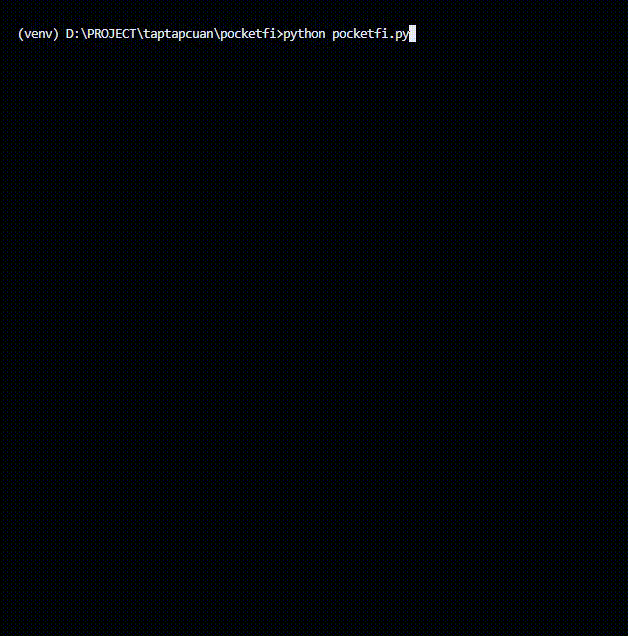

# PocketFi
Seamless cross-chain experience in DeFi on Telegram. Sniping, Copy Trading all in your Pocket - [Official Website](https://pocketfi.org/) .

## Fitur Bot
- Autoclaim user mining
- Autoclaim task daily login
- Multiple Account

## Mainkan Game
|  Link  Game |
| ----------- |
| [Pocketfi Bot](https://t.me/pocketfi_bot/Mining?startapp=785466139) |
| [Pocketfi Bot](https://t.me/pocketfi_bot/Mining?startapp=206741460) |

## Petunjuk Khusus
### Mendapatkan _User-Agent_ & _query_id_
- Pastikan sudah mengikuti [petunjuk umum](../README.md) untuk inspect Telegram Mini Apps
- Jika inspect device sudah berhasil lakukan _reload_ untuk mendapat rekaman aktivitas _Network_
- Masuk ke tab _Network_ > pilih salah satu aktivitas > pada bagian kanan pilih tab _Headers_ > scroll ke bawah cari property _User-Agent_ > copy _value_ dari _User-Agent_
  
- Masuk ke tab _Application_ > _Session Storage_ cari _tgWebAppData_ klik kanan > _copy value_
  

### Update file `pocketfi.json`
- Copy file `pocketfi.example` menjadi `pocketfi.json`
  #### Windows
  ```shell
  copy pocketfi.example pocketfi.json
  ```
  #### Linux
  ```shell
  cp pocketfi.example pocketfi.json
  ```
- Tempel (_paste_) `query_id=xxxx` pada file `pocketfi.json` di dalam property `tgWebAppData`
  Contoh untuk _single account_ :
  ```json
    {
      "accounts" : [
          {
              "tgWebAppData":"query_id=xxxx",
              "User-Agent":"Mozilla/5.0 (Linux; Android 12; M2102J20SG Build/SKQ1.211006.001; wv) AppleWebKit/537.36 (KHTML, like Gecko) Version/4.0 Chrome/126.0.6478.134 Mobile Safari/537.36"
          }
      ],
      "interval" : 30
    }
  ```
  Contoh untuk _multiple account_ :
  ```json
    {
      "accounts" : [
          {
              "tgWebAppData":"query_id=xxxx",
              "User-Agent":"Mozilla/5.0 (Linux; Android 12; M2102J20SG Build/SKQ1.211006.001; wv) AppleWebKit/537.36 (KHTML, like Gecko) Version/4.0 Chrome/126.0.6478.134 Mobile Safari/537.36"
          },
          {
              "tgWebAppData":"query_id=xxxx",
              "User-Agent":"Mozilla/5.0 (Linux; Android 12; M2102J20SG Build/SKQ1.211006.001; wv) AppleWebKit/537.36 (KHTML, like Gecko) Version/4.0 Chrome/126.0.6478.134 Mobile Safari/537.36"
          }
      ],
      "interval" : 30
    }
  ```
  > jangan lupa tanda `,` ketika menambah _property_
- Sesuaikan waktu interval bot untuk autoclaim. Default 30 menit

## Petunjuk Penggunaan
Masuk ke folder game terlebih dahulu :
```shell
taptapcuan> cd pocketfi
taptapcuan\pocketfi> python pocketfi.py
```

## Spoiler


:moneybag: **Happy Cuan!** :money_with_wings:

## Catatan
> `query_id=xxx` bersifat _unique_ dari setiap akun. Didalamnya terdapat pasangan _key_=_value_ yang digenerate otomatis oleh aplikasi telegram setiap kali game dibuka. Untuk menghindari _banned_ dari penyedia layanan, disarankan memperbarui `query_id` setiap harinya karena terdapat parameter _auth_date_ dan _hash_ yang mengacu pada waktu sesi saat membuka game.

## Disclaimer
> Catatan:
>
> Kode bebas untuk dimodifikasi
>
> Jika terjadi error yang disebabkan oleh bug silahkan mengajukan pull-request
>
> **Segala sesuatu yang menyebabkan aktivitas dibanned oleh penyedia layanan bukan menjadi tanggung jawab kami**

## Contact
| [Telegram](https://t.me/AyasMbois) | [Email](mailto:rundhik@yahoo.co.id) |
